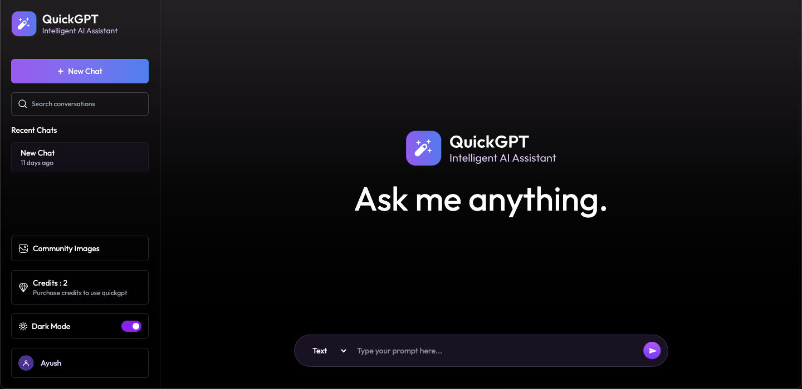

# 🤖 QuickGPT — Full Stack AI Chatbot (MERN + Gemini + ImageKit + Razorpay)



QuickGPT is a **full-stack AI Chatbot application** built using the **MERN stack (MongoDB, Express, React, Node.js)**.  
It allows users to **generate AI-based text and images**, manage **credits**, and make **secure online payments** via Razorpay.  
The app integrates **Google Gemini** for text generation and **ImageKit** for AI image generation.

---

## 🧠 Features

- 🔐 **User Authentication (JWT)**
- 💬 **AI Text Generation** (Google Gemini)
- 🖼️ **AI Image Generation** (ImageKit)
- 💳 **Online Payment Integration** (Razorpay)
- 🪙 **Credit System** (Pay per use)
- 📦 **MongoDB Database** for storing user data & chat history
- ⚡ **Express.js Backend** with secure routes
- 💻 **Responsive Frontend** built using React + Tailwind CSS
- 🚀 **Deployed on Vercel**

---

## 💻 Tech Stack

| Technology                                                                                                     | Description                                                           |
| -------------------------------------------------------------------------------------------------------------- | --------------------------------------------------------------------- |
|                 | Frontend library for building dynamic and interactive user interfaces |
|                          | Next-generation frontend build tool for faster development            |
|  | Utility-first CSS framework for responsive UI design                  |
|                 | JavaScript runtime environment for building the backend               |
|           | Fast, minimal web framework for Node.js                               |
|                 | NoSQL database for storing users, chats, and transactions             |
|              | Elegant MongoDB object modeling for Node.js                           |
|                       | HTTP client for making API requests between frontend & backend        |
|                                            | Password hashing & encryption for secure authentication               |
|                                                    | Middleware for handling cross-origin requests securely                |
|                                                | Loads environment variables from `.env` file                          |
|                   | Secure token-based user authentication                                |
|             | Online payment gateway for credit purchases                           |
|             | Cloud image generation & optimization based on AI prompts             |
|      | AI model integration for text generation                              |

---

## 🚀 Features

| Feature                          | Description                                                                                          |
| -------------------------------- | ---------------------------------------------------------------------------------------------------- |
| 🧍‍♂️ **User Authentication**       | Secure user signup, login, and JWT-based authentication with password hashing using **bcryptjs**     |
| 💬 **AI Text Generation**        | Generate intelligent and creative text replies powered by **Google Gemini AI**                       |
| 🖼️ **AI Image Generation**       | Create stunning images from text prompts using **ImageKit AI**                                       |
| 💳 **Credit System**             | Each action consumes credits — users can purchase more credits via **Razorpay payment gateway**      |
| 🧾 **Razorpay Integration**      | Seamless online payment flow with webhook support for payment verification                           |
| 📦 **Plan Management**           | Multiple subscription plans with different credit limits and features                                |
| 📡 **Real-time Communication**   | Fast API communication between client and server via **Axios** and **Express.js**                    |
| 🧰 **Admin & User Management**   | Store and manage user data, chats, and transactions in **MongoDB** using **Mongoose**                |
| 🖥️ **Modern UI/UX**              | Built with **React.js** and **Tailwind CSS** for a clean, responsive, and interactive user interface |
| 🌐 **Environment Configuration** | Securely manage keys and configurations using **dotenv**                                             |
| ☁️ **Deployment Ready**          | Fully deployable MERN stack app with environment variables and production configurations             |

---

## 🗂️ Folder Structure

```
QuickGPT/
│
├── client/ # Frontend (React.js)
│ ├── public/ # Static assets (icons, images, etc.)
│ ├── src/ # Main source folder
│ │ ├── components/ # Reusable UI components
│ │ ├── pages/ # Page components (Login, Signup, Chat, etc.)
│ │ ├── context/ # Global context (Auth, Chat)
│ │ ├── hooks/ # Custom React hooks
│ │ ├── utils/ # Helper functions
│ │ ├── App.js # Main App component
│ │ └── index.js # Entry point
│ ├── .env # Frontend environment variables
│ ├── package.json # React dependencies and scripts
│ └── vite.config.js # Vite configuration (if using Vite)
│
├── server/ # Backend (Node.js + Express.js)
│ ├── configs/ # Config files (DB, ImageKit, OpenAI, etc.)
│ ├── controllers/ # Route controllers (User, Chat, Webhook, etc.)
│ ├── middlewares/ # Authentication middleware
│ ├── models/ # MongoDB Models (User, Chat, Transaction)
│ ├── routes/ # API routes
│ ├── server.js # Main Express server file
│ ├── .env # Backend environment variables
│ ├── package.json # Backend dependencies and scripts
│ └── nodemon.json # Dev configuration (optional)
│
├── .gitignore # Files ignored by Git
├── README.md # Project documentation
└── package.json # Root-level configuration (if using concurrently)
```

## 🏁 Getting Started

Follow these steps to run the project locally:

1. **Clone the repository:**

```
git clone https://github.com/singhayush007/QUICK_GPT.git
```

2. **Navigate to the project folder:**

```
cd QUICK_GPT
```

3. **Install dependencies:**

```
npm install
```

4. **Create a .env.local file in the root and add your environment variables:**

```
JWT_SECRET=your_jwt_secret

# MongoDB URI
MONGODB_URI=your_mongodb_connection_uri

# Gemini AI API Key
GEMINI_API_KEY=your_gemini_api_key

# ImageKit Configuration
IMAGEKIT_PUBLIC_KEY=your_imagekit_public_key
IMAGEKIT_PRIVATE_KEY=your_imagekit_private_key
IMAGEKIT_URL_ENDPOINT=your_imagekit_url_endpoint

# Razorpay Keys
RAZORPAY_KEY_ID=your_razorpay_key_id
RAZORPAY_KEY_SECRET=your_razorpay_key_secret
RAZORPAY_WEBHOOK_SECRET=your_razorpay_webhook_secret
```

5. **Run the development server and client:**

```
cd client : npm run dev
cd server : npm run server
```

6. **Open the app in your browser:**

```
http://localhost:5173
```

## 💻 Deployment

You can deploy this app using Vercel, Docker, or any Node.js hosting platform.

## 📄 License

This project is licensed under the MIT License — feel free to use and modify it as per your needs.
