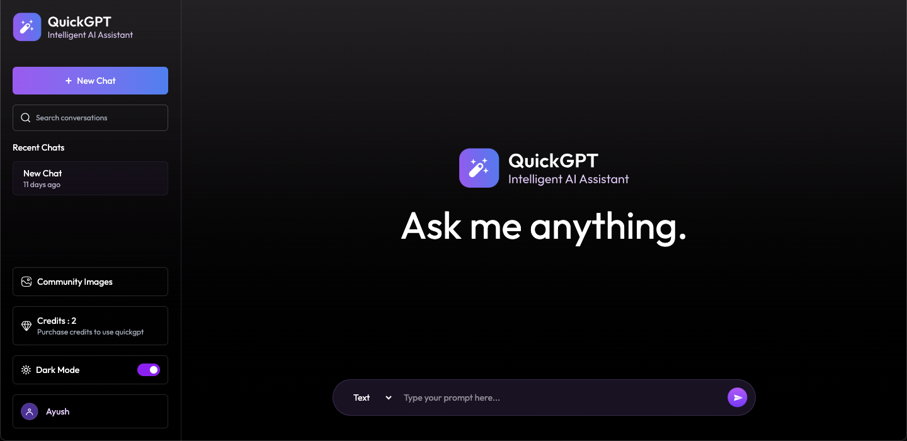

# 🤖 QuickGPT — Full Stack AI Chatbot (MERN + Gemini + ImageKit + Razorpay)

<div align="center">


**A production-ready full-stack MERN AI chatbot with text + image generation, payments, and credit-based usage.**

[🌐 Live Demo](https://quickgptreact.vercel.app/) · [🐛 Report Bug](https://github.com/singhayush007/QUICK_GPT/issues) · [✨ Request Feature](https://github.com/singhayush007/QUICK_GPT/issues)

</div>

---



---

## 📋 Table of Contents

- [About](#-about)
- [Features](#-features)
- [Tech Stack](#-tech-stack)
- [Folder Structure](#️-folder-structure)
- [Getting Started](#-getting-started)
- [Environment Variables](#-environment-variables)
- [Running the App](#️-running-the-app)
- [Deployment](#-deployment)
- [Contributing](#-contributing)
- [License](#-license)

---

## 📖 About

**QuickGPT** is a full-stack MERN AI chatbot platform designed for real-world usage.

- **Users** can sign up/login and generate AI text responses.
- **Image generation** is powered through ImageKit prompt-based workflows.
- **Credits system** ensures pay-per-use consumption tracking.
- **Payments** are integrated with Razorpay for buying more credits.
- **Fallback AI routing** supports Gemini primary with OpenRouter backup.

---

## ✨ Features

| Feature | Description |
| --- | --- |
| 🔐 **JWT Authentication** | Secure signup/login with token-based authentication |
| 💬 **AI Text Generation** | Gemini-powered responses with OpenRouter fallback support |
| 🖼️ **AI Image Generation** | Prompt-to-image flow integrated via ImageKit |
| 🪙 **Credit System** | Usage-based credits for AI actions |
| 💳 **Razorpay Payments** | Purchase credits with secure payment flow + webhook handling |
| 🌤️ **Real-time Utilities** | Weather and sports data integrations (cricket/football APIs) |
| 💻 **Responsive UI** | Clean frontend built with React + Tailwind CSS |
| ☁️ **Deployment Ready** | Split client/server deployment setup for Vercel |

---

## 💻 Tech Stack

### Frontend (`client`)


### Backend (`server`)


---

## 🗂️ Folder Structure

```bash
QUICK_GPT/
│
├── client/                  # Frontend (React + Vite + Tailwind)
│   ├── src/
│   ├── public/
│   ├── .env                 # Local env (not committed)
│   ├── .env.example         # Env template
│   └── package.json
│
├── server/                  # Backend (Node.js + Express)
│   ├── configs/             # DB, AI, payments, media configs
│   ├── controllers/         # Route controllers
│   ├── middlewares/         # Auth middleware
│   ├── models/              # Mongoose models
│   ├── routes/              # API routes
│   ├── utils/               # External API helpers/utilities
│   ├── .env                 # Local env (not committed)
│   ├── .env.example         # Env template
│   ├── server.js
│   └── package.json
│
├── .gitignore
└── README.md
```

---

## 🏁 Getting Started

### Prerequisites

- [Node.js](https://nodejs.org/) v18+
- [npm](https://www.npmjs.com/) v9+
- [MongoDB Atlas](https://www.mongodb.com/cloud/atlas) account
- [Google AI Studio](https://makersuite.google.com/app/apikey) key (Gemini)
- [ImageKit](https://imagekit.io/dashboard) account
- [Razorpay](https://dashboard.razorpay.com) account

### 1. Clone the repository

```bash
git clone https://github.com/singhayush007/QUICK_GPT.git
cd QUICK_GPT
```

### 2. Install dependencies

```bash
# Server
cd server && npm install

# Client
cd ../client && npm install
```

---

## 🔐 Environment Variables

Both packages now include `.env.example` templates.

### Server (`server/.env`)

```bash
cp server/.env.example server/.env
```

| Variable | Description |
| --- | --- |
| `JWT_SECRET` | JWT signing secret |
| `MONGODB_URI` | MongoDB connection string |
| `GEMINI_API_KEY` | Gemini API key (primary AI provider) |
| `USE_GEMINI` | Use Gemini directly (`true`/`false`) |
| `OPENROUTER_API_KEY` | OpenRouter API key (fallback provider) |
| `OPENROUTER_MODEL` | OpenRouter model slug |
| `OPENROUTER_REFERRER` | Referrer header for OpenRouter requests |
| `IMAGEKIT_PUBLIC_KEY` | ImageKit public key |
| `IMAGEKIT_PRIVATE_KEY` | ImageKit private key |
| `IMAGEKIT_URL_ENDPOINT` | ImageKit URL endpoint |
| `RAZORPAY_KEY_ID` | Razorpay key ID |
| `RAZORPAY_KEY_SECRET` | Razorpay key secret |
| `RAZORPAY_WEBHOOK_SECRET` | Razorpay webhook secret |
| `CRICKET_API_KEY` | Cricket API key (optional) |
| `FOOTBALL_API_KEY` | Football API key (optional) |
| `PORT` | Server port (default `3000`) |

### Client (`client/.env`)

```bash
cp client/.env.example client/.env
```

| Variable | Description |
| --- | --- |
| `VITE_SERVER_URL` | Backend API URL (e.g. `http://localhost:3000`) |
| `VITE_RAZORPAY_KEY_ID` | Razorpay public key for client checkout |

---

## ▶️ Running the App

Open **two terminals** and run:

```bash
# Terminal 1 — Backend (http://localhost:3000)
cd server
npm run server
```

```bash
# Terminal 2 — Frontend (http://localhost:5173)
cd client
npm run dev
```

---

## ☁️ Deployment

Deploy **server** and **client** as separate Vercel projects.

| Service | Recommended For |
| --- | --- |
| [Vercel](https://vercel.com) | Client + Server hosting |
| [MongoDB Atlas](https://www.mongodb.com/cloud/atlas) | Database |
| [ImageKit](https://imagekit.io/) | AI image generation/media |
| [Razorpay](https://razorpay.com/) | Payments |

> Make sure all required environment variables are configured in project settings before deployment.

---

## 🤝 Contributing

Contributions are welcome:

1. Fork the repository
2. Create a branch: `git checkout -b feature/your-feature-name`
3. Commit changes: `git commit -m "feat: your feature description"`
4. Push branch: `git push origin feature/your-feature-name`
5. Open a Pull Request

---

## 📄 License

This project is licensed under the **MIT License**.

---

<div align="center">
  Made with ❤️ by <a href="https://github.com/singhayush007">Ayush Singh</a>
</div>
